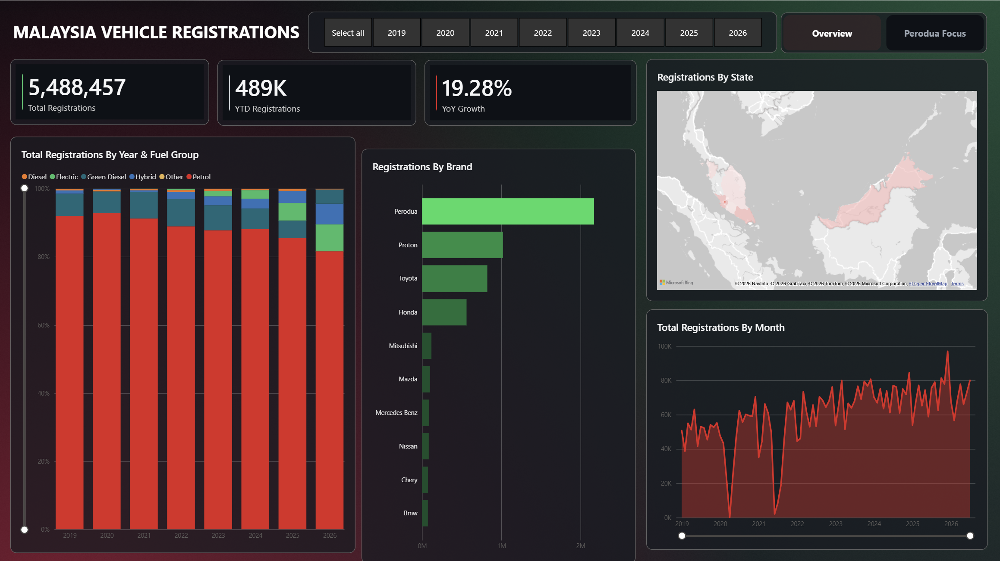
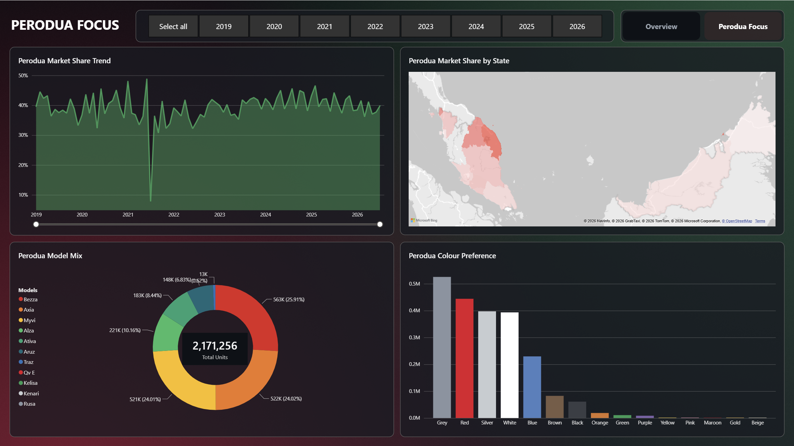
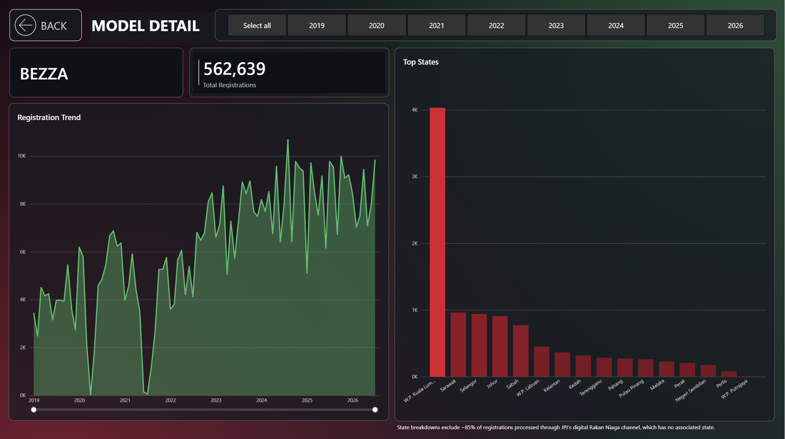

# Perodua Vehicle Registration Analytics: Power BI Portfolio Project

A Power BI dashboard that looks at Malaysian vehicle registration data (2019–2026) to see how Perodua compares to the rest of the national car market. This is built as a portfolio project to show Python, ETL, SQL, data warehousing, Power BI and DAX skills.

## Findings

* Perodua holds 39.56% of national registration volume as of July 2026  
* EV vehicles registration share grew from 0.01% (2019) to 7.9% (2026)  
* Hybrid vehicles registration share grew from 0.97% (2019) to 6.08% (2026)  
* Myvi went from being the most registered Perodua vehicle in 2019 with 34.10% of all Perodua models, to the third in 2026, with Bezza taking first and Axia taking second.

## Live Demo

- **Dashboard (Publish to Web):** [https://app.powerbi.com/view?r=eyJrIjoiZTI0OTllMDctZTJlZC00ZGIyLTllYWEtNmJlNmNmYTY0MWIyIiwidCI6IjgxZGFhMTE0LWZkYWUtNDRkOS05OGJhLTExMmU1ZjhjOGIwZCJ9](https://app.powerbi.com/view?r=eyJrIjoiZTI0OTllMDctZTJlZC00ZGIyLTllYWEtNmJlNmNmYTY0MWIyIiwidCI6IjgxZGFhMTE0LWZkYWUtNDRkOS05OGJhLTExMmU1ZjhjOGIwZCJ9)  
- **Video walkthrough:**  
- **Repo:**

## Screenshots

**Page 1 \- Malaysia Overview** 

**Page 2 \- Perodua Focus** 

**Page 3 \- Model Detail** 

## Data Source

- [data.gov.my](https://data.gov.my) JPJ (Jabatan Pengangkutan Jalan) car registration transactions, CC BY 4.0 licensed  
- Raw grain: one row per registration transaction  
- Columns: `date_reg`, `type`, `maker`, `model`, `colour`, `fuel`, `state`  
- Range used: 1 Jan 2019 – 31 Jul 2026  
- Verified total: **5,488,457** registrations across **149** distinct makers

## Architecture

data.gov.my (CSV)  →  Python ETL (cleaning \+ normalisation)  →  MySQL warehouse (carmart\_dw)  →  Power BI Desktop

## Data Model \- Star Schema

- `fact_registration` \- one row per date/model/state/colour/fuel combination, with a `registration_count` column (1,046,928 fact rows summing to the 5,488,457 total)  
- `dim_date`, `dim_model` (maker → model), `dim_state`, `dim_colour`, `dim_fuel`

## DAX Measures

| Measure | Formula | What it shows |
| :---- | :---- | :---- |
| Total Registrations | `SUM(fact_registration[registration_count])` | Overall market volume |
| Perodua Registrations | `CALCULATE([Total Registrations], dim_model[maker] = "Perodua")` | Perodua's slice only |
| Perodua Market Share % | `DIVIDE([Perodua Registrations], CALCULATE([Total Registrations], ALL(dim_model)))` | Perodua vs. the whole market, by registration volume \- not revenue (see Data Caveats) |
| YTD Registrations | `TOTALYTD([Total Registrations], dim_date[full_date])` | Running total, current year |
| Prior Year Registrations | `CALCULATE([Total Registrations], SAMEPERIODLASTYEAR(dim_date[full_date]))` | Same period, one year back |
| YoY Growth % | `DIVIDE([Total Registrations] - [Prior Year Registrations], [Prior Year Registrations])` | Year-over-year change |
| % of Total by Model | `DIVIDE([Total Registrations], CALCULATE([Total Registrations], ALL(dim_model)))` | Any model's share of the total market, by volume |

## Report Pages

- **Malaysia Overview** \- 3 KPI cards (Total Registrations, YoY Growth %, YTD Registrations), monthly registration trend, top 10 makers, fuel type mix over time, registrations by state  
- **Perodua Focus** \- market share trend, model mix, share by state, colour preference  
- **Model Detail** (drill-through) \- right-click any model on the Model Mix chart to see its own trend and top states

## Design System

The dashboard uses a custom dark theme built around Perodua's logo colors.

| Role | Color | Hex | Where it's used |
| :---- | :---- | :---- | :---- |
| Primary accent | Perodua Red | `#E4002B` | Dominant series (Petrol), negative KPI deltas |
| Secondary accent | Perodua Green | `#1F9D55` | Electric/eco series, positive KPI deltas |
| Neutral | Platinum Silver | `#C7CCD1` | Diesel, gridlines, secondary bars |
| Neutral (dark) | Steel Grey | `#8A93A0` | Axis labels, muted text |
| Deep tint | Maroon | `#7A0E22` | Hybrid fuel series |
| Deep tint | Forest Green | `#145C34` | Green Diesel fuel series |
| Sparing accent | Warm Gold | `#E8B34D` | "Other" catch-all, used only for small highlights |
| Background | Near-black | `#171B20` | Canvas background |

## Validation

Every KPI in this report needs to be checked against the underlying SQL source using a written UAT test log. See `/docs/uat.xlsx` for the full list of test cases.

## Data Caveats

- **Registration ≠ sale.** This dataset counts JPJ registration events, not confirmed retail sales. It's a close stand-in for sales volume, not the exact same thing.  
- **Market share is by volume, not revenue.** "Market Share %" means number of cars registered, not ringgit value \- the source data has no price field. Perodua sells a lot of budget-friendly models (Myvi, Bezza, Axia), so its share by unit count isn't the same as its share by revenue would be. That's also why this project doesn't try to guess a revenue number \- real prices aren't public data.  
- **Maker name normalisation.** Raw JPJ data had inconsistent hyphenation (e.g. "Rolls-Royce" vs "Rolls Royce" appearing as separate makers). Fixed during ETL.  
- **"Rakan Niaga."** Not a real Malaysian state, it's JPJ's online partner registration channel. Kept in the overall totals, but left out of state-level charts and the map, since including it there would make the map wrong.

## Tools

* Python  
* MySQL 8.0  
* Power BI Desktop

## License

Code in this repo is MIT licensed. Underlying data is from data.gov.my and remains CC BY 4.0 licensed by its original publisher.

## Author

Muhammad Irsyaduddin Firdaus Bin Jumai  
irsyaduddin2409@gmail.com  
